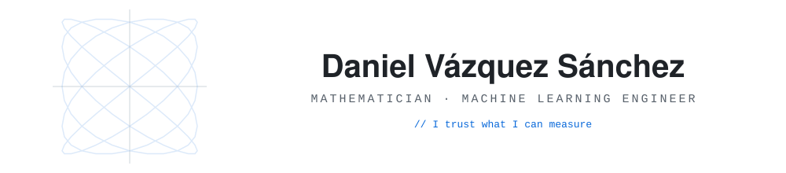

<!--
  GitHub Profile README. Daniel Vazquez Sanchez.
  Repo must be named "danvazsan2" to render as the profile README.
-->

<picture>
  <source media="(prefers-color-scheme: dark)" srcset="banner-dark.svg" />
  
</picture>

---

## About

I build LLM systems and I use mathematics to prove they work.

I'm a Machine Learning Engineer with a **Double Degree in Mathematics & Computer Science**. Over the last year I designed and built production-grade LLM systems, working end-to-end from architecture to evaluation.

My Mathematics background taught me to trust only what I can measure, knowing that a result without proof is just a guess. That means I build LLM systems with evaluation as part of the design: reliable outputs, measurable quality and fewer surprises in production.

I am based in southern Spain 🇪🇸 and open to working with teams who treat AI development as a rigorous discipline, especially the mathematical side of LLMOps: retrieval, evaluation, and inference, where correctness and performance are non-negotiable.

---

## Featured Work

### Local RAG Framework (Bachelor's Thesis)

A **fully local** retrieval-augmented generation framework over private documents **and** SQL databases, with no external APIs. It combines **hybrid search with cross-encoder reranking**, a **natural-language-to-SQL agent**, and a **cascaded query router**, behind a strict multi-layer security policy for safe interaction with relational enterprise data. Every number below is backed by a **reproducible offline evaluation suite**, and the system **abstains** when it lacks solid evidence.

### JudgeCal

An **open-source framework** that treats an LLM judge as a noisy measuring instrument instead of ground truth. It applies **Rogan-Gladen bias correction** and **clustered-bootstrap confidence intervals**, then verifies both against human gold labels rather than asking you to trust them. On a frozen 14B-judge run over 17,790 responses it cut mean judge error from **14.4 to 2.1 points** and showed that **11 of 13 "significant wins"** on a leaderboard were statistical illusions. Every headline number regenerates from **one deterministic command** with no GPU, and CI fails the build if any of them drifts.

---

## Technical Toolkit

**Languages**

**ML / AI**

**Retrieval & Serving**

**Tooling**

---

## Outside the Code

When I step away from distributions and trade-offs, you will usually find me at the **gym**, deep into a **film or an anime**, or lost in a good **video game**. I am a firm believer that a balanced mind is what actually fuels the creativity hard engineering problems demand.

---

## Connect

If you are tackling hard problems in retrieval, inference, or applied LLM systems where correctness and performance are non-negotiable, I would enjoy hearing about what you are building.

